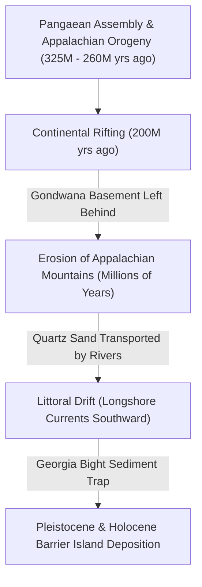

# Geomorphological Report: Amelia Island, Florida
*Based on the Coastal Geomorphology Lectures of Dr. Frank Hopf for Conserve Nassau*

This report synthesizes the scientific facts, geological timelines, and coastal processes governing the formation, evolution, and modern resilience of Amelia Island, Florida. It is based on the presentation series *“Dunes: Not just a pile of sand”* and associated lectures by coastal geomorphologist Dr. Frank Hopf, P.E., hosted by Conserve Nassau.

---

## 1. Executive Summary

Amelia Island, situated in Nassau County at the northernmost point of Florida’s Atlantic coast, is a **composite barrier island** characterized by a dual-age structure: an older **Pleistocene core** (approx. 80,000 to 120,000 years old) on its western, landward side, and a younger band of **Holocene dunes** (formed within the last 11,700 years) on its eastern, seaward side. 

The island lacks any hard bedrock foundation. Physically, it is a dynamic structure composed of **unconsolidated sand and shell fragments overlying deep estuarine mud**. Its long-term stability and resilience depend entirely on the presence of healthy, vegetated dune systems that act as self-regulating, sacrificial barriers against wave energy, tides, and storm surges.

---

## 2. Deep Geological History (Pangaea to Pleistocene)

The materials and processes that formed Amelia Island began hundreds of millions of years ago, tracing a line from the assembly of the supercontinent Pangaea to modern-day coastal transport systems.



### The Appalachian and Gondwanan Origins
*   **Tectonic Heritage:** Deep basement rocks beneath Florida originate from the ancient supercontinent **Gondwana** (African plate). When Pangaea assembled approximately 300 million years ago, Florida was sandwiched between North America, Africa, and South America. During the subsequent Mesozoic rifting (around 200 million years ago), the African plate pulled away, leaving a fragment of its basement rock welded to the North American plate.
*   **The Appalachian Sand Source:** The collision that formed Pangaea also built the **Appalachian Mountains** (the Appalachian Orogeny). Over the next several hundred million years, these mountains underwent intense weathering and erosion. Rivers carved through the mountains, transporting quartz-rich sand, feldspar, and heavy metamorphic minerals (like zircon, staurolite, and tourmaline) down to the Atlantic Ocean.
*   **The Georgia Bight Trap:** Ocean currents (longshore or littoral drift) transported these eroded sediments southward along the Atlantic coast. Amelia Island sits within the **Georgia Bight**, a massive concave bend in the southeastern U.S. coastline. This coastal geometry slows down longshore currents, acting as a natural sediment trap that has accumulated Appalachian quartz sands for millions of years.

---

## 3. Quaternary Geomorphology: Pleistocene vs. Holocene

Amelia Island's composite structure is a direct result of sea-level fluctuations during the Quaternary period, driven by global ice age cycles (Milankovitch cycles).

| Characteristic | Pleistocene Core (Western Portion) | Holocene Dunes (Eastern Portion) |
| :--- | :--- | :--- |
| **Approximate Age** | 80,000 to 120,000 years old | Less than 11,700 years old (mostly < 5,000 years) |
| **Formation Era** | Late Pleistocene (Sangamonian Interglacial) | Holocene Epoch (Post-Glacial Sea Level Rise) |
| **Topographic Position** | Western/landward side (Fernandina Beach, riverfront) | Eastern/seaward side (Atlantic beach front) |
| **Soil Classification** | Highly weathered **Spodosols** (acidic, organic Bh horizon) | Unconsolidated **Entisols** (young, active sands) |
| **Soil Color & Chemistry**| Dark brown/grey due to organic leaching and iron | Light tan/white; high quartz content, shell fragments |
| **Vegetation Canopy** | Mature Maritime Hammock (Live Oak, Southern Magnolia) | Pioneer grasses (Sea Oats), coastal scrub (Saw Palmetto) |
| **Relative Stability** | Geomorphically stable; protected from direct wave impact | Highly dynamic; subject to wind (aeolian) and wave erosion |

### The Pleistocene Core
During the late Pleistocene, glacial melt cycles created sea levels comparable to or slightly higher than present levels. Sand spit accumulation and barrier beach formation built a ridge along what is now the western edge of the island. Over tens of thousands of years of exposure to rain, organic acids from decomposing leaf litter leached down through this sand, forming a dark, cemented organic-iron layer known as a **spodic (Bh) horizon**. This older, weathered core provides the elevation and stability beneath the historic downtown of Fernandina Beach.

### The Holocene Dunes
As the last glacial maximum ended roughly 18,000 years ago, sea levels rose rapidly (nearly 400 feet) as continental ice sheets melted. Around 5,000 to 6,000 years ago, this rise slowed and stabilized, allowing waves and wind to pile newer, unweathered quartz sand against the seaward side of the old Pleistocene core. These active, light-colored sand ridges form the modern beach and dune systems.

---

## 4. Dune Mechanics and Coastal Resilience

A key focus of Dr. Frank Hopf's work is correcting the misconception that dunes are static piles of sand. Dunes are dynamic, self-restoring geological structures governed by wind (aeolian) transport and ecological feedbacks.

> [!IMPORTANT]
> **The "Sacrificial" Feedback Loop of Dunes:**
> Dunes are designed by nature to erode during severe storm events. When high-energy storm waves strike the coast, they pull sand from the foredunes and deposit it in the nearshore zone (creating sandbars). This process makes the nearshore slope shallower and wider. Waves are forced to break further offshore, dissipating their destructive energy before they reach the inland maritime forests and human infrastructure. 

```
Normal State:   [Fore-dune w/ Vegetation] ---> [Beach Face] ---> [Normal Sea Level]
                                                                        
Storm State:    [Eroding Dune] - - (Sand moves offshore) - - -> [Shallow Storm Bar] 
                Wave energy breaks early on the newly formed shallow bar, protecting the interior.
```

### The Biogeomorphic Process
*   **Aeolian Sand Trapping:** Dry sand on the beach is blown landward by onshore winds. Once wind speeds drop or encounter physical obstructions, the sand drops out of transport.
*   **Pioneer Plants as Engineers:** Vegetation is the primary geomorphic agent holding barrier islands together. Without plants, sand dunes would migrate rapidly landward as barren, shifting dunes.
    *   **Sea Oats (*Uniola paniculata*):** The most critical pioneer plant on Amelia Island. They are highly salt-tolerant, thrive in burial by sand, and possess vast, fibrous root networks that extend up to 30 feet, physically binding the loose quartz grains.
    *   **Bitter Panicgrass (*Panicum amarum*) and Railroad Vine (*Ipomoea pes-caprae*):** Ground-covering species that trap sand at lower levels and help stabilize the dune face.
*   **Blowouts and Gaps:** When vegetation is destroyed (by pedestrian traffic, off-road driving, or storm overwash), wind quickly evacuates the sand, creating a bowl-shaped depression called a **blowout**. These gaps become conduits for storm surge during hurricanes, allowing seawater to penetrate inland.

---

## 5. Anthropogenic Impacts and Management Challenges

Human development and coastal engineering have severely altered the natural geomorphic processes of Amelia Island.

### 1. Interruption of Littoral Drift (The St. Marys Jetties)
*   **The Issue:** The natural coastal transport system moves sand from north to south along the Georgia and Florida coasts. In 1881, construction began on massive stone jetties at the **St. Marys River Entrance** (Cumberland Sound) to stabilize the navigation channel for military and commercial shipping.
*   **Geomorphic Consequence:** These jetties act as a complete barrier to the southward migration of sand. Sand builds up on the northern side of the jetties (Cumberland Island, Georgia), while Amelia Island (to the south) is starved of its natural sand replenishment. This has caused severe, chronic erosion on the northern end of Amelia Island (Fort Clinch area) and along the Atlantic beaches.

### 2. Beach Renourishment: A Temporary Solution
*   **The Process:** To combat jetty-induced erosion, millions of cubic yards of sand are dredged from offshore sources and pumped onto the beaches of Amelia Island.
*   **The Science:** While renourishment protects beachfront properties, it is a cyclical, costly process. Offshore dredged sand often has a different grain size and shell content than native Appalachian sand, which can affect dune stability, slope angles, and nesting habitats for sea turtles.

### 3. Dune Walkover Infrastructure
*   **The Threat:** Dr. Hopf highlights that traditional wooden walkovers constructed with heavy, closely spaced pilings can disrupt aeolian processes. They block the wind, preventing sand from blowing landward to rebuild the dunes, and can act as focal points for wave erosion during storms.
*   **The Solution:** The Dune Science Group advocates for **nature-based design**, including lighter, elevated, or flexible path walkovers that allow sand to migrate freely beneath them and accommodate the natural growth and movement of the dune system.

### 4. Downtown Fernandina Beach Flooding
*   **The Vulnerability:** Historic downtown Fernandina Beach sits on the western (Pleistocene) side of the island along the Amelia River. Unlike the Atlantic side, it is not protected by a wide dune system. 
*   **Geomorphic Risk:** The area is vulnerable to tidal flooding (king tides) and storm surges pushed up the river. Dr. Hopf’s presentations analyze the limitations of hard seawalls or flood walls, which can deflect wave energy to adjacent areas and block natural drainage, advocating instead for integrated coastal zone management that includes living shorelines and setback regulations.

---

## 6. Scientific Timeline Summary

The geological epochs and events that shaped Amelia Island:

| Age / Period | Geological Event | Geomorphic Output on Amelia Island |
| :--- | :--- | :--- |
| **~1.1 Billion Years Ago** | Grenville Orogeny | Initial formation of basement rocks that would become the Appalachian Mountains. |
| **~325 – 260 Million Years Ago** | Appalachian Orogeny (Pangaea Assembly) | Creation of the Appalachian Mountains, the ultimate source of Amelia Island's quartz sand. |
| **~200 Million Years Ago** | Breakup of Pangaea | Florida's basement rock (Gondwanan origin) remains attached to the North American plate. |
| **~120,000 – 80,000 Years Ago** | Late Pleistocene (Sangamonian Interglacial) | Formation of the island's western core. Soil weathering initiates the creation of the acidic Spodosol profile (Bh horizon). |
| **~18,000 – 11,700 Years Ago** | Last Glacial Maximum to Early Holocene | Sea levels rise ~400 feet, moving the shoreline landward and pushing sands toward their current positions. |
| **~5,000 Years Ago – Present** | Mid-to-Late Holocene | Sea levels stabilize. Wave action and aeolian processes form the eastern dune ridges (Entisols) and modern beach face. |
| **1881 – Present** | Industrial / Anthropogenic Era | Construction of St. Marys Jetties, interrupting longshore drift and initiating the modern era of critical erosion and beach renourishment. |
